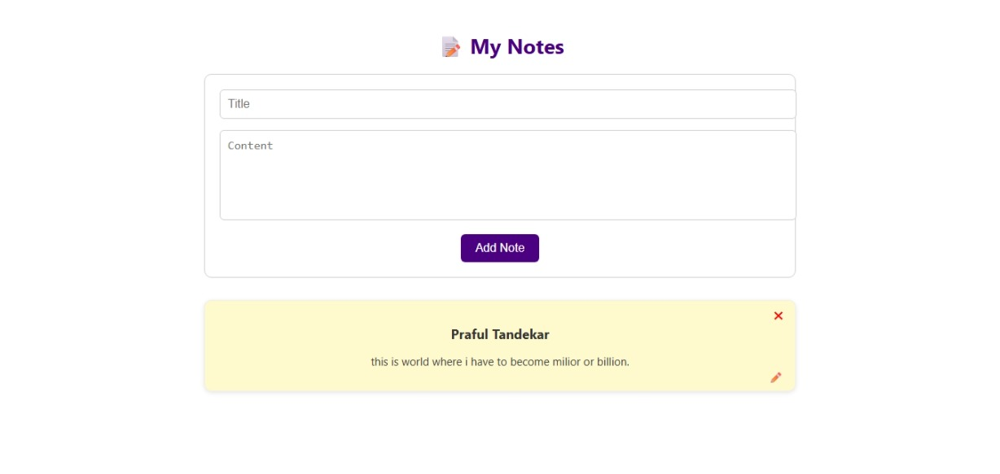

# 📝 NotesApp

A powerful and user-friendly **Notes App** built with **React.js**.  
It allows users to easily create, edit, delete, pin, tag, color, and search notes in a clean and responsive interface.

---

## 🚀 Features

✅ Add, edit, and delete notes    
🔍 Search notes by content  
🏷️ Add and filter by tags  
🎨 Assign different colors to notes  
💾 Data persistence using `localStorage`  
🧠 Clean and intuitive UI for productivity

---

## 🚀 Live Demo

👉 [Click here to view the deployed app](https://fancy-cocada-f6d004.netlify.app/)

## 📸 Screenshots

| Dashboard View | Colored & Pinned Notes |
|----------------|------------------------|
|  |

---

## ⚙️ Tech Stack

- **React.js**
- **HTML5 & CSS3**
- **JavaScript (ES6)**
- **localStorage**
- **Custom Hooks & Components**

---
## 🧠 Folder Structure

NotesApp/
│
├── public/
├── src/
│ ├── components/
│ ├── App.js
│ ├── index.js
├── package.json
└── README.md